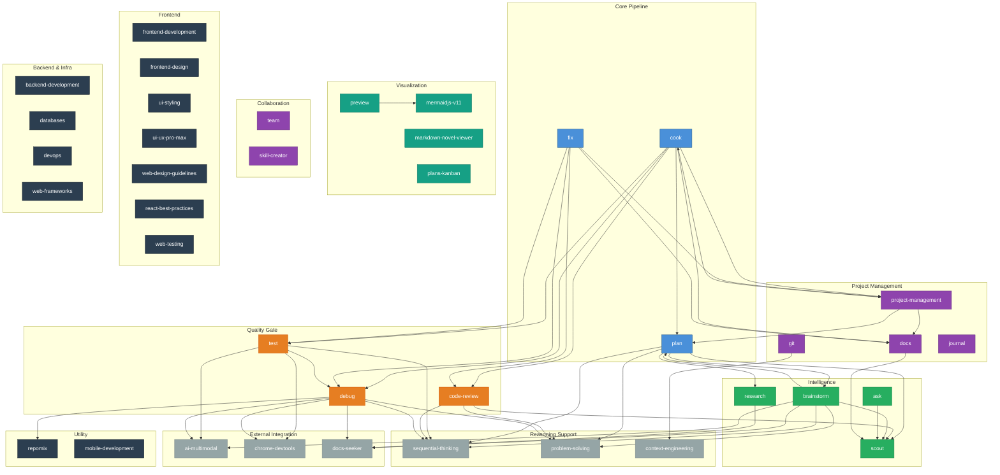

# Skills Dependency Graph

**Last Updated**: 2026-03-16
**Total Skills**: 39

## ASCII Overview

```
     ┌──────────┐   ┌──────────┐   ┌─────────┐
     │ research │   │   plan   │   │   git   │
     └────┬─────┘   └──┬──┬───┘   └────┬────┘
          │             │  │            │
          ▼             │  │            ▼
    ┌───────────┐       │  │    ┌──────────────────┐
    │docs-seeker│       │  │    │context-engineering│
    └───────────┘       │  │    └──────────────────┘
                        ▼  ▼
                  ┌──────────┐     ┌──────────┐
                  │   cook   │     │   fix    │
                  └─┬──┬──┬──┘     └─┬──┬──┬──┘
                    │  │  │          │  │  │
       ┌────────────┘  │  │    ┌────┘  │  └────────┐
       ▼               │  │    ▼       │            ▼
   ┌───────┐           │  │  ┌─────┐   │      ┌──────────┐
   │ test  │           │  │  │debug│   │      │code-review│
   └───┬───┘           │  │  └──┬──┘   │      └─────┬────┘
       │               │  │     │      │            │
       ▼               ▼  ▼     ▼      ▼            ▼
   ┌─────────────────────────────────────────────────────┐
   │              SUPPORT SKILLS LAYER                   │
   │  sequential-thinking  problem-solving  ai-multimodal│
   │  docs-seeker  chrome-devtools  repomix  scout       │
   └─────────────────────────────────────────────────────┘
                           │
                           ▼
           ┌───────────────────────────────┐
           │     FINALIZATION LAYER        │
           │  project-management    docs   │
           │  git (commit/push)            │
           └───────────────────────────────┘
```

## Mermaid Diagram



## Dependency Summary

### Most Depended On (used by N other skills)
| Skill | Dependents |
|-------|-----------|
| sequential-thinking | 6 (plan, test, code-review, debug, brainstorm, ask) |
| scout | 5 (plan, code-review, brainstorm, ask, docs) |
| problem-solving | 4 (plan, code-review, debug, brainstorm) |
| debug | 4 (cook, fix, test, code-review) |
| docs-seeker | 4 (debug, research, brainstorm, ask) |
| ai-multimodal | 3 (test, debug, brainstorm) |
| chrome-devtools | 2 (test, debug) |
| repomix | 1 (debug) |
| context-engineering | 1 (git) |
| mermaidjs-v11 | 1 (preview) |

### Leaf Skills (zero dependents — domain/utility)
Frontend: frontend-development, frontend-design, ui-styling, ui-ux-pro-max, web-design-guidelines, react-best-practices, web-testing
Backend: backend-development, databases, devops, web-frameworks
Other: mobile-development, skill-creator

### Core Chain
```
plan → cook → test → code-review → project-management
fix  → debug
```

## Categories (11)

| Category | Count | Skills |
|----------|-------|--------|
| Core Pipeline | 3 | plan, cook, fix |
| Quality Gate | 3 | test, code-review, debug |
| Intelligence | 4 | brainstorm, ask, research, scout |
| Reasoning Support | 3 | sequential-thinking, problem-solving, context-engineering |
| External Integration | 3 | ai-multimodal, chrome-devtools, docs-seeker |
| Project Management | 4 | project-management, docs, git, journal |
| Visualization | 4 | preview, markdown-novel-viewer, plans-kanban, mermaidjs-v11 |
| Collaboration | 2 | team, skill-creator |
| Frontend | 7 | frontend-development, frontend-design, ui-styling, ui-ux-pro-max, web-design-guidelines, react-best-practices, web-testing |
| Backend & Infra | 4 | backend-development, databases, devops, web-frameworks |
| Utility | 2 | repomix, mobile-development |
